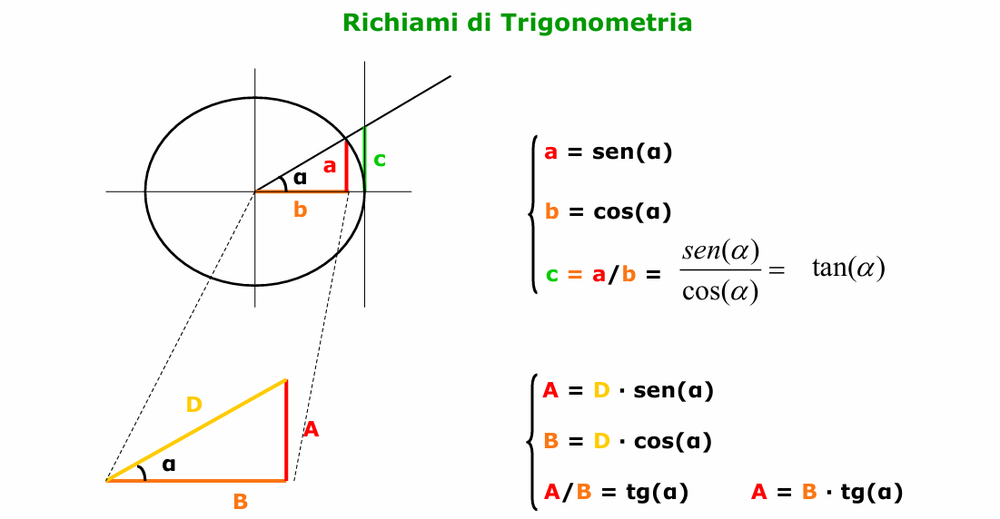

# Algebra vettoriale

## Somma di vettori 
Per sommare due vettori si possono **scomporre nelle loro componenti orizzontali e verticali** usando seno e coseno.

Se un vettore ha modulo VVV e forma un angolo θ\thetaθ con l’asse orizzontale:

- componente orizzontale: Vx=Vcos⁡(θ)V_x = V \cos(\theta)Vx​=Vcos(θ)
- componente verticale: Vy=Vsin⁡(θ)V_y = V \sin(\theta)Vy​=Vsin(θ)

Poi si sommano **separatamente le componenti**:

- somma delle componenti orizzontali  
    Rx=V1x+V2xR_x = V_{1x} + V_{2x}Rx​=V1x​+V2x​
- somma delle componenti verticali  
	Ry=V1y+V2yR_y = V_{1y} + V_{2y}Ry​=V1y​+V2y​

Il vettore risultante R rappresenta **lo spostamento totale** prodotto dai due vettori.

Proprietà Associativa della Somma di Vettori (A+B)+C  = A+(B+C)

## Differenza di vettori 
Operando sulle componenti si può eseguire la differenza di due vettori prendendo semplicemente la differenza delle componenti corrispondenti (si introduce un segno meno al posto della somma).

# Richiami di trigonometria 

## Versori
i versori sono Vettori di lunghezza unitaria (modulo = 1), privi di dimensione e definiti allo scopo di identificare una direzione e un verso. Convenzionalmente si identificano con le lettere i, j e k i versori tracciati nelle direzioni degli assi cartesiani X, Y e Z con verso positivo

## prodotto di un vettore per uno scalare
Quando si moltiplica un vettore **A** per un numero reale, chiamato **scalare** s, si ottiene un nuovo vettore **B**. Questa operazione si esprime con la relazione:

**B = s · A**

Il risultato è un vettore che mantiene alcune caratteristiche del vettore iniziale, mentre altre cambiano in base al valore dello scalare.

Per quanto riguarda **il modulo**, cioè la lunghezza del vettore, esso diventa pari al prodotto tra il valore assoluto dello scalare e il modulo del vettore di partenza. In altre parole, la lunghezza del nuovo vettore è ∣s∣⋅mod(A)|s| · \text{mod}(A)∣s∣⋅mod(A). Questo significa che il vettore può **allungarsi** se il valore assoluto di sss è maggiore di 1, oppure **accorciarsi** se è compreso tra 0 e 1.

La **direzione** del vettore, invece, **rimane invariata**: il nuovo vettore si trova sulla stessa linea d’azione del vettore originale **A**.

Infine, il **verso** dipende dal segno dello scalare. Se sss è **positivo**, il vettore **B** mantiene lo stesso verso di **A**; se invece sss è **negativo**, il vettore **B** assume **verso opposto** rispetto al vettore iniziale.