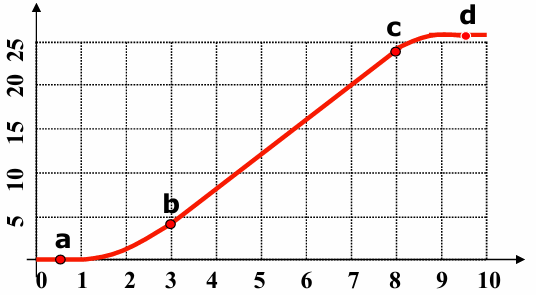
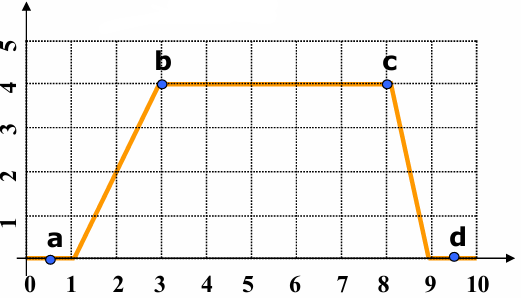
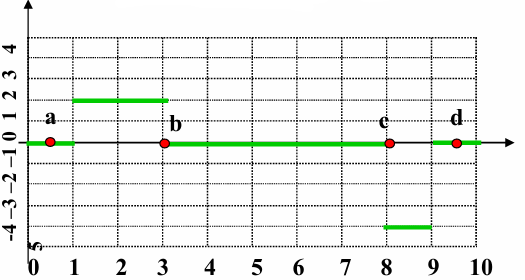

### Velocità (istantanea)
La misura tuttavia più vicina alla quotidianità di velocità e la velocità istantanea cioè la velocità che troviamo nel quadro strumenti delle nostre auto. questa rappresenta la velocita che il corpo ha nel momento della rilevazione.
nel nostro grafico Essa coincide con il coefficiente angolare $m$ della retta tangente alla funzione della posizione tempo.

L'operazione matematica che ci permette di trovare la retta tangente ad una funzione è la derivata della funzione che descrive i movimento.
quindi usiamo
$$
v = \frac{dx}{dt}
$$

### Grafico della posizione, velocità e accelerazione
  
In questo grafico vediamo che la velocita non è costante ma che aumenta (accelerazione) esegue un tratto a velocita costante per poi rallentare (decelerare).

per prima cosa scomponiamo in diversi tratti da calcolare 

#### Tratto 0 - A 
in questo tratto vediamo che non c'è spostamento quindi la velocità è nulla.
* $V_a = \frac{\Delta x}{\Delta t} = \frac{0-0}{1-0} = 0 m/s$ 
* $V_d = \frac{\Delta x}{\Delta t} = \frac{26-26}{10-9} = 0 m/s$  

#### Tratto B-C
in questo tratto la velocita è costante quindi possiamo usare la formula della velocita media
 
* $V_{bc}= \frac{\Delta x}{\Delta t}= \frac{24-4}{8-3}=4 m/s$ 

#### Tratti AB e CD
I tratti che rimangono sono i tratti AB e CD cioè quelli di accelerazione e decelerazione 
Qui non possiamo approssimare a nessuna funzione consueta quindi useremo la derivata per ottenere la velocita 
$$v= \frac{dx}{dt}$$
inserendo i risultati otteniamo questo grafico
 

Proprio come la velocità è la variazione della posizione, l'accelerazione è la variazione della velocità nel tempo. Le formule fondamentali da usare sono:

- **Accelerazione Media:** $\vec{a}=\frac{\Delta\vec{v}}{\Delta t}$
    
- **Accelerazione Istantanea:** $\vec{a}=\frac{d\vec{v}}{dt}$ (che equivale anche alla derivata seconda della posizione: $\frac{d^{2}\vec{x}}{dt^{2}}$)

 
- La formula $x(t) = x(t_0) + \int_{t_0}^{t} v(t') dt'$ ci dice che la posizione in un dato istante $x(t)$ è uguale alla posizione iniziale $x(t_0)$ più lo spostamento totale avvenuto in quell'intervallo di tempo.

- **Significato grafico:** L'integrale della velocità nel tempo ($\int v \cdot dt$) corrisponde all'**area sottesa alla curva** (o alla linea) nel grafico della velocità.
